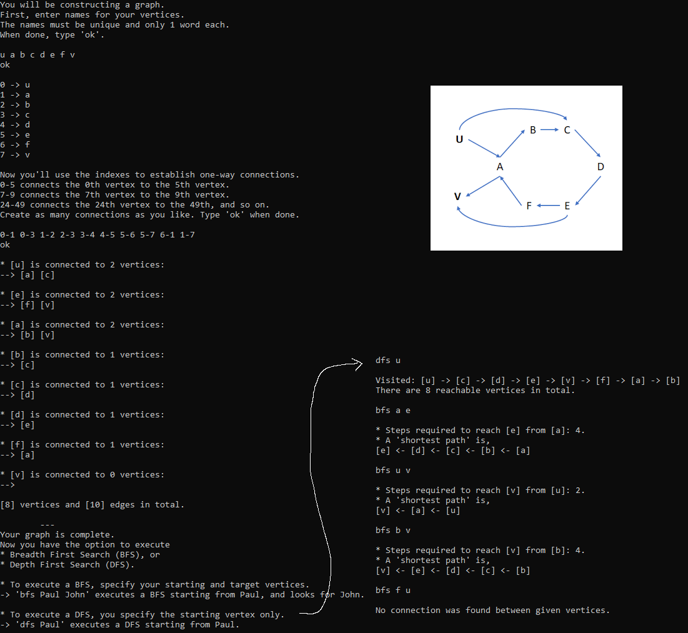

Build and run main.
The program will assist you in constructing a directed & unweighted graph from the ground up.
And then you can either run a BFS search from your chosen source to your chosen target, or run DFS to "explore".

Confused? Inspect the incredible diagram I put together in MS Paint.

